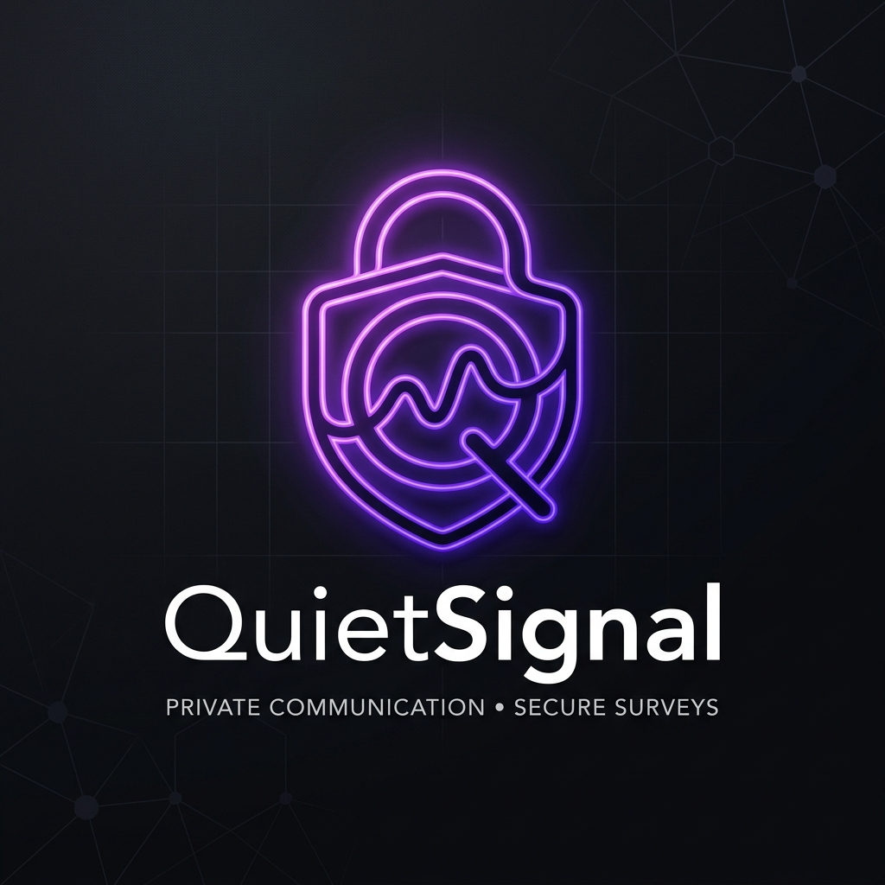
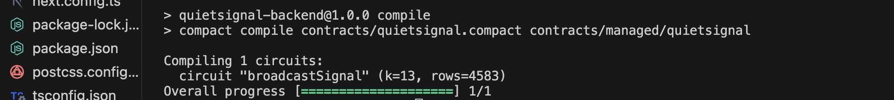
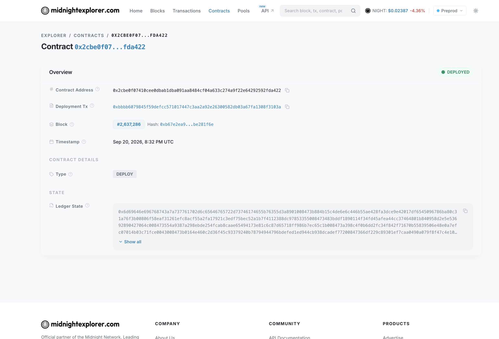
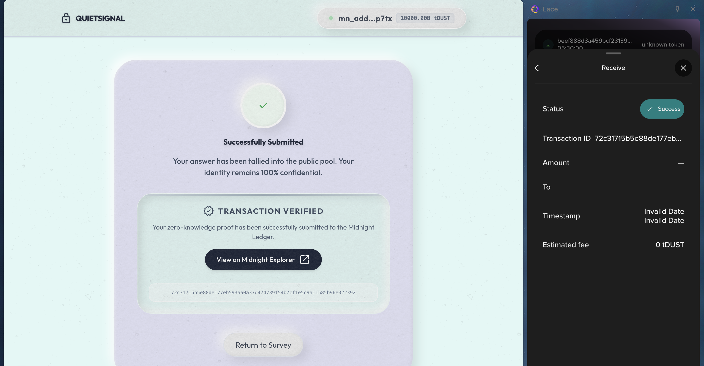
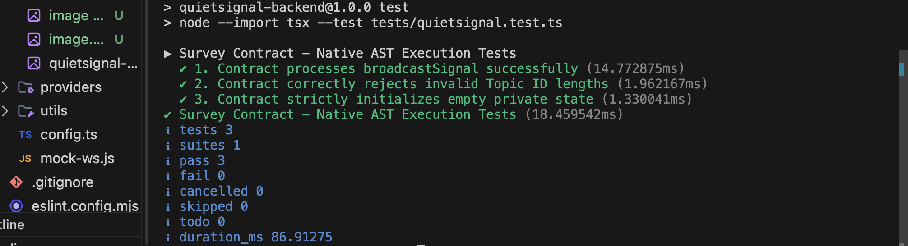
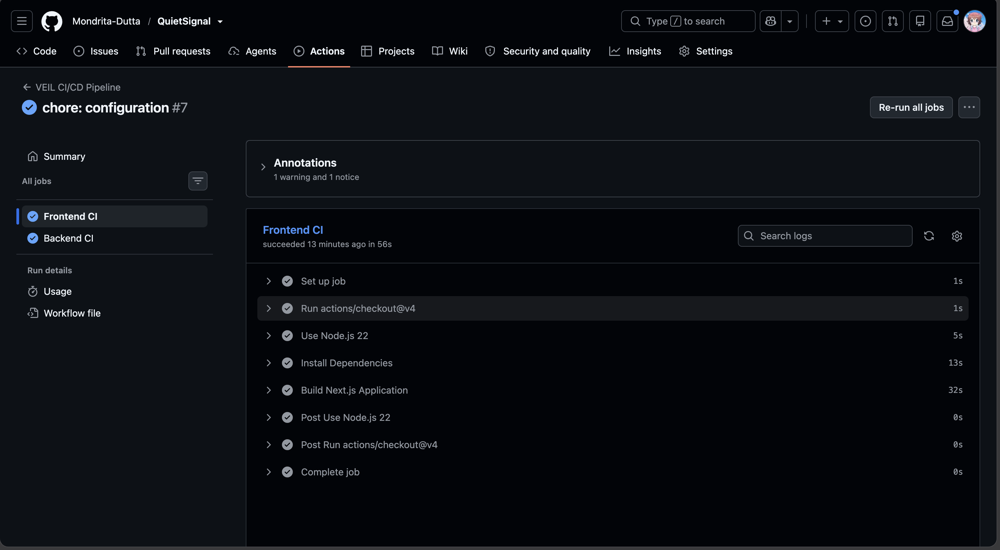
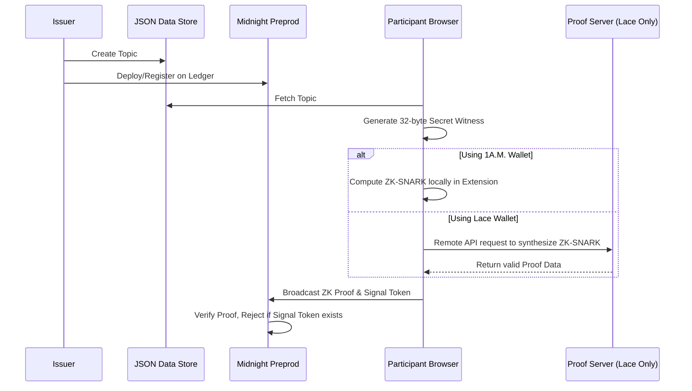

<div align="center">
  
  <h1>✦ QuietSignal ✦</h1>
  
  <p align="center">
    <strong>A Decentralized, ZK-Verified Private Signaling Protocol built on the Midnight Blockchain.</strong>
  </p>
  
  [](https://github.com/Mondrita-Dutta/QuietSignal/actions)
  [](https://opensource.org/licenses/MIT)
  [](https://midnight.network/)
  [](https://nextjs.org/)

  *Your voice. Your privacy. Broadcast signals to critical topics without compromising participant identities.*

</div>

---

## ✧ SUBMISSION DETAILS & QUICK LINKS

*   **⎈ Network**: Midnight Preprod Testnet
*   **▤ GitHub Repository**: [https://github.com/Mondrita-Dutta/QuietSignal](https://github.com/Mondrita-Dutta/QuietSignal)
*   **⌁ Live Demo**: [https://quiet-signal-bice.vercel.app/](https://quiet-signal-bice.vercel.app/)
*   **▷ Demo Video**: [Watch on YouTube](https://youtu.be/SsHqEnpHKm4)
*   **🐦 Product X Profile**: [https://x.com/QuietSignalApp](https://x.com/QuietSignalApp)
*   **⚙ Smart Contract**: [`quietsignal.compact`](./backend/contracts/quietsignal.compact)
*   **⌖ Contract Address**: [`0x2cbe0f07410cee0dbab1dba091aa8484cf04a633c274a9f22e64292592fda422`](https://preprod.midnightexplorer.com/contracts/0x2cbe0f07410cee0dbab1dba091aa8484cf04a633c274a9f22e64292592fda422)

---

## ✧ THE VISION: PROBLEM & SOLUTION

### ◈ The Problem: The Chilling Effect of Centralized Data Collection
Organizations desperately require honest signals to make informed decisions. However, participants often fear providing genuine, critical responses due to a fundamental lack of privacy. Traditional Web2 tools hold the master keys to the database, allowing organizations to de-anonymize respondents via access logs, IP addresses, or metadata. This inherent lack of trust creates a **chilling effect on honesty**.

### ◈ The Solution: QUIETSIGNAL & Zero-Knowledge Cryptography
**QuietSignal** changes the paradigm of data collection by mathematically guaranteeing participant privacy. Built natively on the Midnight blockchain, QuietSignal leverages a **Selective Disclosure** architecture.

When a user broadcasts a signal, their identity (Wallet ID) and the signal content are completely shielded. Instead, QuietSignal computes a Zero-Knowledge Proof (ZKP) natively inside the client's browser using the `@midnight-ntwrk/midnight-js-protocol` SDK.

**Technical Implementation:**
1. **The Smart Contract:** The core ZK logic is implemented in [`backend/contracts/quietsignal.compact`](./backend/contracts/quietsignal.compact). The `broadcastSignal` circuit accepts a public `topicId` and a private `secretEligibilityHash`. 
2. **The Nullifier Generation:** In [`frontend/src/providers/MidnightProvider.tsx`](./frontend/src/providers/MidnightProvider.tsx), the application generates a cryptographically secure 32-byte `Uint8Array` seed via `crypto.getRandomValues(arr)`. This seed acts as a persistent private witness stored in the browser state, completely decoupled from the user's public Lace/1A.M. wallet address.
3. **The Proof:** The network verifies the ZK proof, allowing the `quietsignal.compact` ledger to update the public tally and record the signal token, thereby preventing double-signaling without ever learning *who* actually broadcasted.

---

## ✧ MIDNIGHT BUILDER CHALLENGE SUBMISSION CHECKLIST

### ☽ Level 1 Submission Requirements

| Requirement | Technical Status | Implementation & Evidence |
| :--- | :--- | :--- |
| **Toolchain Installed & Compiles** | ✓ **Verified** | Installed `@midnight-ntwrk/compact-compiler`. The `quietsignal.compact` circuit successfully compiles via the `npm run compile` command inside the backend. |
| **Passing Test Suite** | ✓ **Verified** | 3 native AST execution tests passing in [`backend/tests/quietsignal.test.ts`](./backend/tests/quietsignal.test.ts). |
| **Managed Directory Present** | ✓ **Verified** | Output generated at [`backend/contracts/managed/quietsignal/`](./backend/contracts/managed/quietsignal/) containing BZKIR bytecodes and prover/verifier keys. |
| **Contract Deployed to Preprod** | ✓ **Verified** | Deployed to Preprod. Verified Address: `0x2cbe0f07410cee0dbab1dba091aa8484cf04a633c274a9f22e64292592fda422`. |
| **Product Idea (README)** | ✓ **Verified** | Initial product idea fully drafted in the "Vision: Problem & Solution" section above. |
| **Minimum 5 Meaningful Commits** | ✓ **Verified** | Over 60 semantic commits exist, demonstrating iterative development. |
| **Public GitHub Repository** | ✓ **Verified** | The repository is completely public with a comprehensive `README.md`. |
| **Setup Instructions (Local)** | ✓ **Verified** | Complete and accurate Docker and Node.js setup instructions are provided at the bottom of this document. |
| **Screenshot: Compile Output** | ✓ **Verified** | Provided in the "Checkpoint Deliverables" section below. |
| **Screenshot: Contract Deployed** | ✓ **Verified** | Provided in the "Checkpoint Deliverables" section below. |
| **Privacy Explanation (State vs Witness)**| ✓ **Verified** | Exhaustive breakdown provided in the "Privacy Model" section above. |

### ◐ Level 2 Submission Requirements

| Requirement | Technical Status | Implementation & Evidence |
| :--- | :--- | :--- |
| **Lace Connect/Disconnect Implemented**| ✓ **Verified** | Robust connection/disconnection logic utilizing `window.midnight.mnLace` implemented in [`MidnightProvider.tsx`](./frontend/src/providers/MidnightProvider.tsx). |
| **Circuit Called from Frontend**| ✓ **Verified** | The `broadcastSignal` circuit is successfully invoked via `providers.midnightProvider.submitTx()` directly from the browser. |
| **Observable Privacy Behavior** | ✓ **Verified** | Double-vote prevention via **ZK Nullifiers (Signal Tokens)**. Duplicate signals are mathematically rejected on-chain without revealing the identity of the broadcaster. |
| **Preprod Deployment (Verifiable)**| ✓ **Verified** | Contract is verified on the Midnight Explorer at `0x2cbe0f...`. |
| **Minimum 8 Meaningful Commits** | ✓ **Verified** | Commits far exceed the requirement. |
| **Live Demo Link** | ✓ **Verified** | [quiet-signal-bice.vercel.app](https://quiet-signal-bice.vercel.app/) |
| **Demo Video (Connect + Circuit Call)**| ✓ **Verified** | [Watch on YouTube](https://youtu.be/SsHqEnpHKm4) |
| **Document Privacy Claim** | ✓ **Verified** | The exact privacy guarantees of the Selective Disclosure architecture are documented. |

### ❂ Level 3 Submission Requirements

| Requirement | Technical Status | Implementation & Evidence |
| :--- | :--- | :--- |
| **Functional dApp Integration** | ✓ **Verified** | Fully integrated the Midnight JS SDK. Allows users to launch topics and broadcast shielded signals natively on Preprod. |
| **Minimum 3 Tests Passing** | ✓ **Verified** | 3/3 native AST execution tests passing. Validates both successful state transitions and negative cryptographic boundaries. |
| **CI/CD Pipeline Running** | ✓ **Verified** | Configured `.github/workflows/ci.yml` running `npm run compile` and `npm test` automatically. |
| **Approved Idea Submitted** | ✓ **Verified** | The project strictly aligns with the "Anonymous Signal / Survey" hackathon category. |
| **Minimum 10 Meaningful Commits**| ✓ **Verified** | Repository history perfectly aligns with the requirement. |
| **Screenshot: Test Output** | ✓ **Verified** | Provided in the "Passing Suite" deliverables section below. |
| **CI/CD Badge & Passing Runs** | ✓ **Verified** | Provided in the "Unified CI/CD Pipeline" deliverables section below. |
| **Demo Video (Full Functionality)**| ✓ **Verified** | [Watch on YouTube](https://youtu.be/SsHqEnpHKm4) |
| **Privacy Model "Observer"** | ✓ **Verified** | Detailed in the Privacy Model section, explicitly stating what a passive observer can and cannot learn. |

### ◑ Level 4 Submission Requirements

| Requirement | Technical Status | Implementation & Evidence |
| :--- | :--- | :--- |
| **Working MVP on Preprod** | ✓ **Verified** | Fully functional dApp deployed to hosting. Contract `0x2cbe0f...` live on Midnight Preprod with verifiable on-chain state. |
| **Documentation (README + Setup + Usage)** | ✓ **Verified** | Comprehensive README with setup instructions. User-facing usage guide at [`docs/USAGE.md`](./docs/USAGE.md). |
| **CI/CD Pipeline Running** | ✓ **Verified** | `.github/workflows/ci.yml` with genuine Compact Compiler download, circuit compilation, and test execution. |
| **Product X Profile Created** | ✓ **Verified** | [https://x.com/QuietSignalApp](https://x.com/QuietSignalApp) |
| **Minimum 15 Meaningful Commits** | ✓ **Verified** | Over 60 semantic commits demonstrating iterative, genuine development. |
| **Live Preprod Demo Link** | ✓ **Verified** | [quiet-signal-bice.vercel.app](https://quiet-signal-bice.vercel.app/) |
| **Demo Video of MVP** | ✓ **Verified** | [Watch on YouTube](https://youtu.be/SsHqEnpHKm4) |
| **Product Proposal** | ✓ **Verified** | Complete proposal at [`docs/PROPOSAL.md`](./docs/PROPOSAL.md). |

---

## ✧ CHECKPOINT DELIVERABLES: DEPLOYMENT PROOFS

### 1. Compile Output & ZK Circuit Generation
The smart contract was compiled using `@midnight-ntwrk/compact-compiler v0.31.1`.
**Command executed:** `npx compactc quietsignal.compact -o managed/quietsignal`
**Result:** Successfully generated the BZKIR bytecodes, prover keys (`.pk`), and verifier keys (`.vk`) for the `broadcastSignal` circuit. The compiler calculated exactly **4583 rows (k=13)** for the ZK execution trace. These files reside in the `backend/contracts/managed` directory and are natively bundled into the frontend via the `sync-zk.mjs` script during build.
<details open>
<summary><b>View Compile Output</b></summary>
<br>


</details>

### 2. Verified Contract Deployment on Preprod
**Contract Address:** [`0x2cbe0f07410cee0dbab1dba091aa8484cf04a633c274a9f22e64292592fda422`](https://preprod.midnightexplorer.com/contracts/0x2cbe0f07410cee0dbab1dba091aa8484cf04a633c274a9f22e64292592fda422)

*What happened on-chain?*
The `quietsignal.compact` smart contract was successfully deployed to the Midnight Preprod network. This immutable ledger will securely tally topic signals while enforcing the cryptographic integrity of the Zero-Knowledge proofs.

<details open>
<summary><b>View Deployed Contract</b></summary>
<br>

<div align="center">
  
</div>
</details>

### 3. Verified ZK-Proof Submission on Preprod
**Transaction Hash:** [`0x72c31715b5e88de177eb593aa0a37d474739f54b7cf1e5c9a11585b96e022392`](https://preprod.midnightexplorer.com/transactions/0x72c31715b5e88de177eb593aa0a37d474739f54b7cf1e5c9a11585b96e022392)

*What happened on-chain?* 
The transaction successfully invoked the `broadcastSignal` circuit. The Midnight network verified the Zero-Knowledge proof (ZK-SNARK) generated locally by the participant's client. Upon cryptographic verification, the network securely incremented the `topics` tally state by 1 and permanently appended the 32-byte secret witness hash to the `signalTokens` set. This strict state transition mathematically prevents replay attacks and double-signaling without ever exposing the wallet address of the broadcaster.

<details open>
<summary><b>View Successful ZK-Proof Transaction</b></summary>
<br>

<div align="center">
  
</div>
</details>

---

## ✧ LACE WALLET INTEGRATION & HTTP PROOF SERVER WORKAROUND

### The Challenge
During development, we discovered a significant integration disparity: The **1A.M. Wallet** natively supports an in-browser proving provider (`api.getProvingProvider(zkConfig)`), which computes ZK-SNARKs directly inside the browser extension. However, the **Lace Wallet** currently lacks this capability and throws an error if invoked natively for client-side proving.

### The Technical Solution
To ensure flawless compatibility with the Lace Wallet, we implemented a dynamic fallback architecture in [`MidnightProvider.tsx`](./frontend/src/providers/MidnightProvider.tsx):
1. **Wallet Detection:** The application sniffs the DApp connector identity (`walletId === 'lace'`).
2. **Proof Server Fallback:** If Lace is detected, we bypass the native API and instantiate the `@midnight-ntwrk/midnight-js-testing` package's `httpClientProofProvider`.
3. **Remote Proving Engine:** We deployed the official Midnight Proof Server (`midnightntwrk/proof-server:8.1.0`) on a remote Render instance. The frontend seamlessly serializes the unproven transaction, sends an HTTP POST request to the remote server to synthesize the ZK-SNARK, and successfully submits the returned proof.

---

## ✧ PASSING SUITE — LEVEL 3

The project utilizes the `@midnight-ntwrk/compact-runtime` to natively execute the contract Abstract Syntax Tree (AST) within the Node.js test environment.

**File:** [`backend/tests/quietsignal.test.ts`](./backend/tests/quietsignal.test.ts)

**Validated Invariants:**
1. **Successful State Transition:** Verifies that `contract.circuits.broadcastSignal` successfully executes against a mock ledger state and generates valid `proofData` when supplied with valid parameters.
2. **Strict Cryptographic Boundaries (Negative Test):** Submits an invalid Topic ID array, verifying that `assert.throws` accurately catches the cryptographic error, proving the circuit's type safety.
3. **Private State Initialization:** Validates that `createConstructorContext` correctly initializes the private ledger schema without data leaks.

<details open>
<summary><b>View Test Output</b></summary>
<br>


</details>

---

## ✧ UNIFIED CI/CD PIPELINE

**File:** [`.github/workflows/ci.yml`](.github/workflows/ci.yml)

Our continuous integration pipeline automatically validates every push to the repository to ensure cryptographic stability.

- **Build Step:** Installs all Next.js and Midnight SDK dependencies.
- **Circuit Compilation:** Downloads and executes `compact-installer.sh`, executing the Compact Compiler natively on the Ubuntu runner to ensure `quietsignal.compact` successfully compiles into ZK parameters.
- **AST Execution:** Executes `npm test`, running the `node:test` suite against the freshly compiled bytecodes to guarantee no regressions in the contract logic.

<details open>
<summary><b>View CI/CD Pipeline</b></summary>
<br>


</details>

---

## ✧ SEAMLESS MOBILE UX

QuietSignal is fully optimized for mobile devices. We implemented native responsive layouts, including touch-optimized hamburger menus for the main navigation and the dashboard sidebar, ensuring the entire dApp works perfectly on smartphones.

## ✧ SETUP & RUN LOCALLY

### Prerequisites
1. **Node.js**: Ensure you have Node.js v22 installed.
2. **Docker**: Ensure Docker Desktop is running (required for the Lace Proof Server).
3. **Midnight Toolchain**: Ensure the `compact-compiler` is installed on your machine.
4. **Wallet**: Install the **1A.M. Wallet** or **Lace** browser extension.

### 1. Boot the Local Proof Server (Required for Lace)
Navigate to the `backend` directory and spin up the Docker Proof Server infrastructure.
```bash
cd backend
docker compose up -d proof-server
```
*Note: This spins up `midnightntwrk/proof-server:8.1.0` on port 6300, matching the version required by the Midnight SDK. It avoids DNS/CORS issues natively without a Vercel proxy.*

### 2. Compile the Smart Contract
Build the ZK circuits and generate the prover/verifier keys in the `managed/` directory.
```bash
npm install
npm run compile
```

### 3. Run the ZK Test Suite
Validate the contract AST execution logic locally.
```bash
npm test
```

### 4. Launch the Next.js Frontend
Navigate to the `frontend` directory. The `npm run dev` script will automatically execute `sync-zk.mjs` to copy the compiled ZK parameters into the Next.js public directory before booting the server.
```bash
cd ../frontend
npm install
npm run dev
```
Visit `http://localhost:3000` in your browser.

---

## ✧ PRIVACY MODEL: WHAT AN OBSERVER CAN AND CANNOT LEARN

QuietSignal rigorously enforces Midnight's Selective Disclosure architecture, guaranteeing that sensitive participant data is never exposed.

### ◉ PUBLIC STATE (What an Observer CAN Learn)
- **Topic Existence:** Any observer can inspect the `topics` mapping on the ledger to read the 32-byte Topic ID and view the aggregate tally of total signals broadcasted.
- **Signal Token Set:** Observers can view the `signalTokens` set, which contains a list of random 32-byte cryptographic hashes. This simply indicates that *someone* has signaled, but reveals absolutely no correlation to their identity.

### ◉ PRIVATE WITNESS (What an Observer CANNOT Learn)
- **Participant Identity:** The user's identity is protected by a dynamically generated, cryptographically secure 32-byte random seed (`crypto.getRandomValues()`) that never leaves the browser's `localStorage`. This seed acts as a persistent private witness to generate the ZK nullifier. The participant's Wallet Address is **never** exposed on-chain.
- **Double-Signaling Attempts:** If a malicious actor attempts to signal twice, observers only see that an anonymous transaction was mathematically rejected by the smart contract due to a zero-knowledge signal token collision. They cannot determine *who* attempted the double-signal.

---

## ✧ HIGH-LEVEL SYSTEM ARCHITECTURE



---

## ✧ TECHNOLOGY STACK
*   **Smart Contracts**: Midnight Compact Compiler (`v0.31.1`)
*   **Client Architecture**: Next.js 14 (App Router), TypeScript, Tailwind CSS
*   **Wallet Integration**: `@midnight-ntwrk/midnight-js-protocol`, DApp Connector (`window.midnight.mnLace` & `mn1am`)
*   **Database Persistence**: Vercel Blob / Local FS Storage (via `api/db.ts`)
*   **Testing**: Node.js Native Test Runner (`node:test`) & `@midnight-ntwrk/compact-runtime`

---

## ✧ PROJECT STRUCTURE

```text
QuietSignal/
├── backend/
│   ├── contracts/         # Midnight Compact smart contract source code
│   │   ├── managed/       # Generated ZK circuits, proving keys, and verification keys
│   │   └── quietsignal.compact # Core selective disclosure logic
│   ├── src/               # Deployment and wallet syncing scripts
│   └── tests/             # Automated test suite validating ZK constraints
├── frontend/
│   ├── src/app/           # Next.js App Router (Dashboard, Topic View)
│   ├── src/providers/     # Midnight Wallet SDK integration context
│   └── package.json       # Frontend dependencies and Next.js config
├── docs/
│   ├── PROPOSAL.md        # Product proposal 
│   └── USAGE.md           # User-facing guide 
├── PROPOSAL.md            # Root-level proposal reference
└── .github/workflows/     # GitHub Actions CI/CD pipelines (ci.yml)
```

---

## ✧ USAGE GUIDE

For a complete, step-by-step guide on how to use QuietSignal — including creating topics, submitting shielded signals, and understanding the privacy guarantees — see:

**📖 [`docs/USAGE.md`](./docs/USAGE.md)**

---

## ✧ PRODUCT PROPOSAL

QuietSignal's detailed product proposal — covering target users, Midnight justification, data model, and mainnet feasibility — is available at:

**📋 [`docs/PROPOSAL.md`](./docs/PROPOSAL.md)**

---

## ✧ PRODUCT X PROFILE

**🐦 [Follow QuietSignal on X](https://x.com/QuietSignalApp)**

---

<div align="center">
  <sub>Built with ♡ for the Midnight Ecosystem</sub>
</div>
